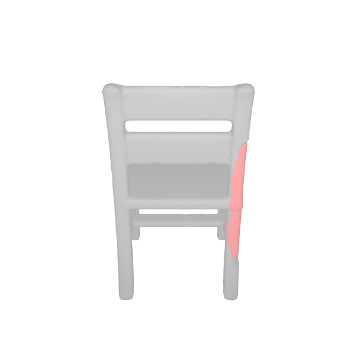
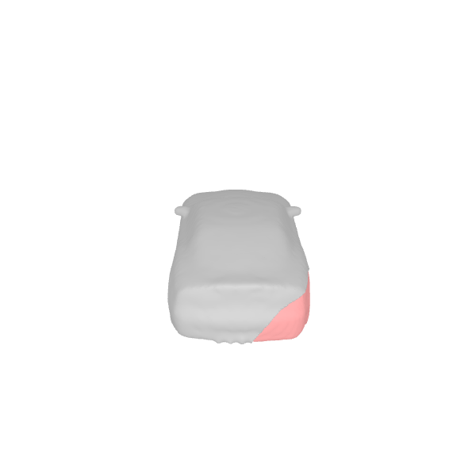
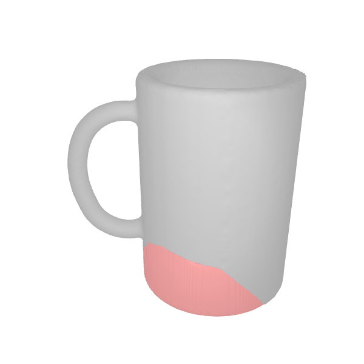

# DeepMend
Code for "DeepMend: Learning Occupancy Functions to Represent Shape for Repair." \
Published at ECCV 2022.

   

```
@inproceedings{lamb2022deepmend,
  title={DeepMend: Learning Occupancy Functions to Represent Shape for Repair},
  author={Lamb, Nikolas and Banerjee, Sean and Banerjee, Natasha Kholgade},
  booktitle={European Conference on Computer Vision},
  pages={433--450},
  year={2022},
  organization={Springer}
}
```

We are now accepting broken object donations via the form below! \
[Broken Object Donations](https://forms.gle/B8V5UiVSirEM8N5m8)

## Installation

Code tested using Ubutnu 18.04 and python 3.8.0.
Note that you need to have the following apt dependencies installed. 
```bash
sudo apt install python3.8-distutils python3.8-dev libgl1 libglew-dev freeglut3-dev
```

We recommend using virtualenv. The following snippet will create a new virtual environment, activate it, and install deps.
```bash
sudo apt-get install virtualenv && \
virtualenv -p python3.8 env && \
source env/bin/activate && \
pip install -r requirements.txt && \
./install.sh && \
source setup.sh
```
Issues with compiling pyrender are typically solved by upgrading cython: `pip install --upgrade cython`.

If you want to run the fracturing and sampling code, you'll need to install pymesh dependencies:
```
./install_pymesh.sh
```

## Quickstart Inference

If you just want to try out inference, run the following script with the example file. This will infer a restoration and create a gif.
```
cd deepmend
./scripts/infer_quick.sh experiments/mugs/specs.json ../example_files/fractured_mug.obj
```

## Data Preparation

See `fracturing/README.md`.

## Training

Navigate into the `deepmend` directory.
```
cd deepmend
```

Each experiment needs a corresponding directory with a "specs.json" file. You can find an example at `deepmend/experiments/mugs`.

To train, run the training python script with the path to an experiment directory.
```
python python/train.py -e experiments/mugs
```

## Inference

Navigate into the `deepmend` directory.
```
cd deepmend
```

Inference (and related operations) is done in four steps:

1) Infer latent codes. 
2) Reconstruct meshes. 
3) Generate renders. 
4) Evaluate meshes.


Each experiment needs a corresponding directory with a "specs.json" file. You can find an example at `deepmend/experiments/mugs`.

To infer:
```
./scripts/infer.sh experiments/mugs
```

Data is saved in the experiment directory passed to the reconstruction script, under a `Reconstructions` subdirectory. For example, results for the mugs example will be stored in `deepmend/experiments/mugs/Reconstructions/ours/`. Meshes are stored in the `Meshes` subdirectory. A render of all the results is stored in the top-level reconstruction directory. 
